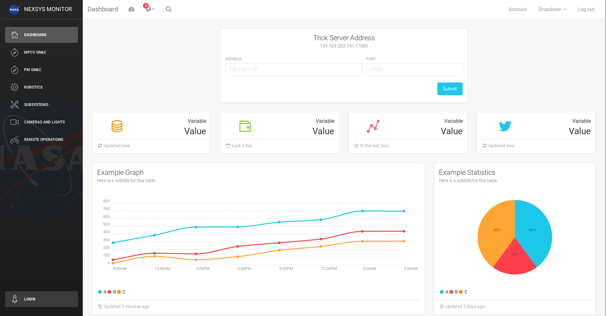
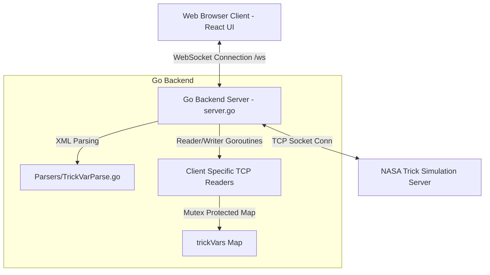

# 🚀 NASA NExSyS Simulation Monitor Dashboard

<p align="center">
  
</p>

<p align="center">
  <strong>Enterprise-grade, high-performance real-time telemetry visualizer for the NASA Extensible Simulation System (NExSyS)</strong>
</p>

<p align="center">
  
  
  
  
  
</p>

---

## 📌 Overview

### What is this?
The **NASA NExSyS Simulation Monitor Dashboard** is a high-performance web application designed for real-time visualization of live telemetry streamed from **Trick Simulation Servers**. Developed for the **NASA Extensible Simulation System (NExSyS)**, it provides simulation engineers, researchers, and test conductors with immediate, responsive browser-based monitoring of complex aerospace simulations.

### The Problems It Solves
- 🔴 **Fragmented Telemetry Views:** Consolidates data from disparate simulation components into a singular, unified layout.
- 🔴 **Desktop Abstraction Barriers:** Removes the dependency on heavy, platform-specific desktop applications, offering instant, browser-accessible monitoring.
- 🔴 **Telemetry Lag:** Solves sub-second refresh needs using lightweight WebSockets paired with a highly concurrent Go backend, avoiding heavy database layers or expensive HTTP polling.

### Primary Business Value
> **Accelerates decision-making and anomaly detection during simulation runs by delivering immediate, multi-system telemetry updates in less than 100ms with zero data overhead.**

---

## 📂 Project Structure & Extended Documentation

To maintain clean and granular documentation, our technical documentation is structured as follows:

| Document | Purpose | File Link |
|----------|---------|-----------|
| **Architecture Specification** | Concurrency model, detailed data flow, state management, and structural smells | [docs/architecture.md](file:///a:/shinobi no shuriken/github repo/React-GoLang-Real-time-Dashboard-master/React-GoLang-Real-time-Dashboard-master/docs/architecture.md) |
| **API Reference** | WebSocket payloads, TCP command formats, and message schemas | [docs/api.md](file:///a:/shinobi no shuriken/github repo/React-GoLang-Real-time-Dashboard-master/React-GoLang-Real-time-Dashboard-master/docs/api.md) |
| **Complete Setup Guide** | Comprehensive installation, XML variable config instructions, and deployment guides | [docs/setup.md](file:///a:/shinobi no shuriken/github repo/React-GoLang-Real-time-Dashboard-master/React-GoLang-Real-time-Dashboard-master/docs/setup.md) |
| **Startup & Port Remedy** | Root Cause Analysis, self-healing port scanners, and Windows socket debugging | [docs/startup_and_port_conflict_remedy.md](file:///a:/shinobi no shuriken/github repo/React-GoLang-Real-time-Dashboard-master/React-GoLang-Real-time-Dashboard-master/docs/startup_and_port_conflict_remedy.md) |
| **Changelog & History** | Project history, architectural versions, and future roadmap | [CHANGELOG.md](file:///a:/shinobi no shuriken/github repo/React-GoLang-Real-time-Dashboard-master/React-GoLang-Real-time-Dashboard-master/CHANGELOG.md) |

---

## ✨ Features

- ⚡ **Real-Time Telemetry Streaming:** Multi-panel sub-second dashboard running over high-speed WebSockets.
- 🛰️ **Subsystem Panels:** Detailed panels for distinct aerospace modules:
  - **MPCV:** Multi-Purpose Crew Vehicle Guidance, Navigation, and Control.
  - **PM:** Power Management (MBSUs, PDUs, solar arrays).
  - **Robotics:** NextStep mechanical arms, doors, and rover interfaces.
  - **SubSys:** Cabin Environmental Systems (Potable Water, TCS, ARS, PCS).
  - **Cams/Lights:** Camera control (Telescopes and AerCams).
  - **RoverLLT:** Rover and Low Latency Telemetry status.
- 🔌 **Dynamic Server Reconnection:** Seamless switching and connection to active Trick servers at run-time.
- ⚙️ **XML Configuration Driven:** Automatic parsing of XML-based variable configurations (`vars_displayed.xml`) using a custom Go XML parser.

---

## 🏗 High-Level Architecture

The system utilizes a lightweight, non-blocking asynchronous pipeline designed for low latency.



For a comprehensive explanation of our concurrency safeguards and performance characteristics, see [docs/architecture.md](file:///a:/shinobi%20no%20shuriken/github%20repo/React-GoLang-Real-time-Dashboard-master/React-GoLang-Real-time-Dashboard-master/docs/architecture.md).

---

## 🛠 Tech Stack

### Backend
* **Language:** Go 1.26+ (standard library for high concurrency)
* **WebSocket Library:** `github.com/gorilla/websocket` (v1.5.3)
* **Concurrency Primitives:** Channels, Goroutines, `sync.RWMutex`

### Frontend
* **Core:** React 16.2.0 (Functional & Class components)
* **UI/Styles:** Bootstrap 3.3.7, React-Bootstrap 0.32.1, SASS (Dart Sass v1.77.1)
* **Routing & State:** React Router DOM v4.2.2, native Browser WebSockets
* **Charts:** Chartist.js 0.10.1 (low CPU utilization render)

### External Systems
* **NASA Trick Simulation Server:** Provides TCP-based simulation engines.

---

## ⚙️ Quick Start

### 1. Prerequisites
Ensure you have the following installed:
- **Node.js** (v14+ recommended) and **npm**
- **Go** (1.26+ recommended)

### 2. Clone and Install Dependencies
```bash
# Clone the repository
git clone https://github.com/NASA/React-GoLang-Real-time-Dashboard.git
cd React-GoLang-Real-time-Dashboard

# Install Node dependencies
npm install
```

### 3. Start in Development Mode
Start both services concurrently to enable hot-reloading:

```bash
# Terminal 1: Start React SASS compiler and dev server
npm start

# Terminal 2: Run Go backend (Arg 1: Host ip & port)
go run server.go localhost:3000
```
Then navigate your browser to `http://localhost:3000`.

> [!IMPORTANT]
> To connect to a local development backend, ensure that the WebSocket address on line 585 of [src/variables/Variables.jsx](file:///a:/shinobi%20no%20shuriken/github%20repo/React-GoLang-Real-time-Dashboard-master/React-GoLang-Real-time-Dashboard-master/src/variables/Variables.jsx) is configured to match the target address (e.g., `ws://localhost:3000/ws`).

For advanced setups, XML modifications, and production builds, please refer to the complete [Setup Guide](file:///a:/shinobi%20no%20shuriken/github%20repo/React-GoLang-Real-time-Dashboard-master/React-GoLang-Real-time-Dashboard-master/docs/setup.md).

---

## 🧪 Testing

The React build system includes built-in test runner configurations.

To run the frontend test suites:
```bash
npm run test
```

To profile or run Go backend components:
```bash
go test ./...
```

---

## ⚠️ Security Notes

1. **Intended Network:** Designed exclusively for secure, internal NASA networks. No default authentication is included.
2. **CORS Configuration:** The WebSocket upgrader has permissive origin checking (`CheckOrigin` returns `true`). For external deployments, this must be restricted to authenticated origins.
3. **No SSL by Default:** Raw WS and HTTP protocols are used. Deploy behind an SSL-terminating reverse proxy (like Nginx) for HTTPS/WSS encryption.

For the comprehensive Security Guide, see [docs/architecture.md#11-security-profile](file:///a:/shinobi%20no%20shuriken/github%20repo/React-GoLang-Real-time-Dashboard-master/React-GoLang-Real-time-Dashboard-master/docs/architecture.md#11-security-profile).

---

⭐ **Star the project** if this dashboard helps your NASA NExSyS simulation workflow!
