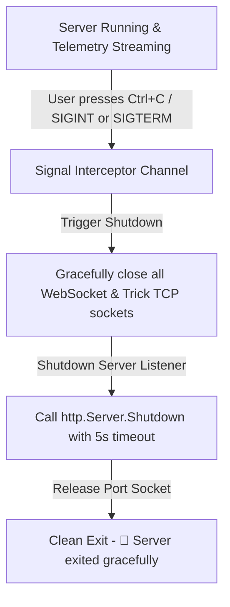
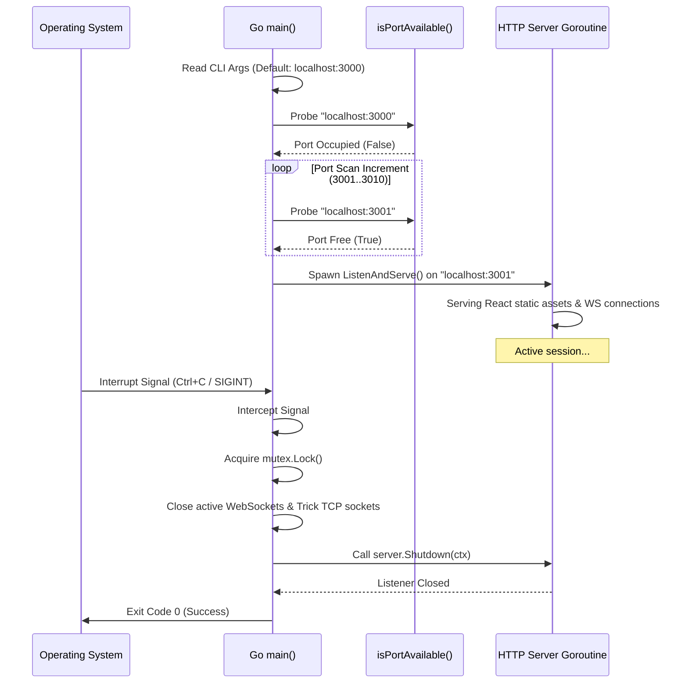

# 🚀 System Startup & Port Conflict Remedy

This document provides a comprehensive technical audit of the socket binding failure on the **NExSyS Simulation Monitor Dashboard**, details our newly implemented self-healing port prevention logic, and details a complete guide for socket debugging on Windows systems.

---

## 1. Root Cause Analysis (RCA)

The socket binding failure (`bind: Only one usage of each socket address is normally permitted`) occurs when the Go application attempts to start a listener on a network socket address (IP + Port) that is already bound and occupied by another active process.

### 🔍 Architectural Diagnostics

```
                     Requested Host:Port (e.g. 127.0.0.1:3000)
                                      │
                   Is another process bound to this socket?
                                     / \
                                    /   \
                                  YES    NO
                                  /       \
     [Windows Socket Layer rejects bind]   [Socket successfully bound]
    "Only one usage of each socket address  "HTTP Server starting on localhost:3000"
      is normally permitted (WSAEADDRINUSE)"
```

In this full-stack project, there are three primary sources of port `3000` conflicts:

1. **The React Development Server Conflict:**
   The standard React build system (`react-scripts start`) defaults to binding on port `3000` for client UI asset delivery. If `npm start` is booted before Go, port `3000` will be blocked by the `node.exe` worker process, causing Go to crash on startup.
2. **Zombie Backend Processes (Orphan builds):**
   If an earlier Go server session (`go run server.go`) is terminated forcefully (e.g., stopping terminal without killing the subprocesses, or closing the IDE), the child binary (e.g., `server.exe` running from standard Temp directories like `C:\Users\...\AppData\Local\go-build`) becomes an orphan process. It continues to run in the background, keeping the socket bound.
3. **Goroutine Leak / Parallel Execution:**
   Attempting to launch two instances of the Go server in different command windows or terminal buffers.

---

## 2. Dynamic Port Conflict Prevention & Self-Healing Logic

To resolve this and make the server completely crash-proof, we replaced the simple `http.ListenAndServe` with a **dynamic port scanner fallback**.

### 🛠️ How It Works (The Self-Healing Pipeline)

1. **Port Availability Probing:** Prior to binding, the server attempts to establish a temporary TCP listener via `net.Listen("tcp", addr)`. If successful, it immediately closes the listener and uses that port.
2. **Dynamic Range Scanning (Fallback):** If the requested port is occupied, the backend splits the address and executes an incremental search, testing the next **10 consecutive ports** (e.g., `3001` through `3010` if `3000` was busy).
3. **First Available Bind:** As soon as an open socket is found, the server terminates the probe and starts the HTTP server. If no port is free in the range, it exits with a fatal log.

---

## 3. The Graceful Shutdown Lifecycle

Killing servers abruptly can leave client TCP sockets and WebSockets in a half-open state, causing high CPU overhead on the simulation engine and preventing immediate socket reuse.

We have integrated a **signal-driven graceful shutdown handler** using standard OS primitives:



### 🔐 Thread-Safety Guardrails
During shutdown, the connection registry is protected using a shared read/write lock (`sync.RWMutex`). The backend calls `closeAllClients()`, acquiring a exclusive `mutex.Lock()`, closing both client-side WS buffers and simulator-side TCP channels cleanly.

---

## 4. Windows PowerShell Debugging Command Suite

If you suspect zombie processes are blocking your development ports, use this command cheat sheet in your PowerShell terminal:

### 4.1 Find the Process ID (PID) occupying Port 3000
```powershell
Get-NetTCPConnection -LocalPort 3000 -ErrorAction SilentlyContinue | Select-Object LocalAddress, LocalPort, OwningProcess, State
```

### 4.2 Identify the Executable Name of the Occupying Process
```powershell
Get-NetTCPConnection -LocalPort 3000 -ErrorAction SilentlyContinue | ForEach-Object { Get-Process -Id $_.OwningProcess } | Format-Table Id, Name, Path, Description
```

### 4.3 Forcefully Terminate the Process Occupying Port 3000
```powershell
# Get connection PID and kill it forcefully
$conn = Get-NetTCPConnection -LocalPort 3000 -ErrorAction SilentlyContinue
if ($conn) {
    Stop-Process -Id $conn[0].OwningProcess -Force
    Write-Host "✅ Process $($conn[0].OwningProcess) successfully terminated."
} else {
    Write-Host "ℹ️ Port 3000 is already free."
}
```

### 4.4 Prune All Zombie Go and Node Processes
```powershell
Stop-Process -Name go, server, node, compile -Force -ErrorAction SilentlyContinue
```

---

## 5. Startup and Bind Architecture Flow

Below is the sequence of the new server lifecycle starting up, detecting a busy socket, falling back, and terminating cleanly:


